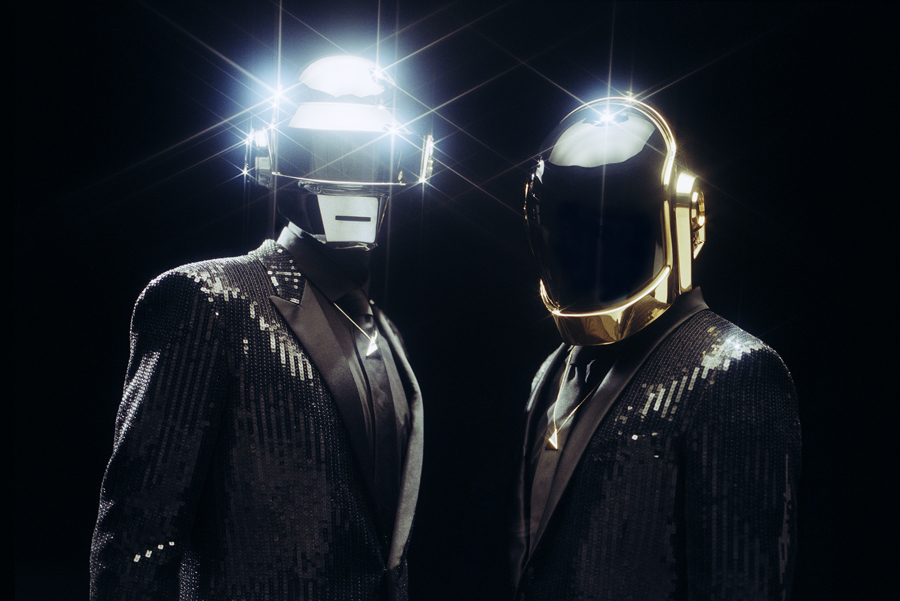

# Jukebot

Discord music bot is a private music bot that runs on Google Cloud.



## Setting up project

### Installation

```bash
npm install
```

Install dependencies, should be run after pulling changes from repo in case anyone
added new package to the project.

### Windows

```bash
npm install -g windows-build-tools
```

This command globally installs Windows build tools.
If you don't have `.NET Framework 2.0 SDK` or other missing Windows dependency installed your npm install will error.

## Project Structure

```
wildfire
├── README.md            This project documentation.
├── node_modules         NPM modules. *transient*
├── package.json         NPM configuration.
├── src                  Source code for the app.
│   ├── app.ts           Main ( entry point ).
├── tsconfig.json        TSC configuration for /src
├── tslint.json          TSLint configuration for linting .ts files.
├── .prettierrc          Prettier configuration for formatting files.
├── ffmpeg               FFMPEG binaries.
├── cloudbuild.yaml      Build instructions for Google Cloud Builder.
├── app.yaml             Google App Engine configuration.
```

## Building

### Build Javascript bundles

```bash
npm run gcp-build
```

This command is going to build the app and create the transpiled javascript files in the `/dist` folder.

## Run a local server

```bash
npm run start
```

This command will run `/dist/app.js` (it needs to be built first)
